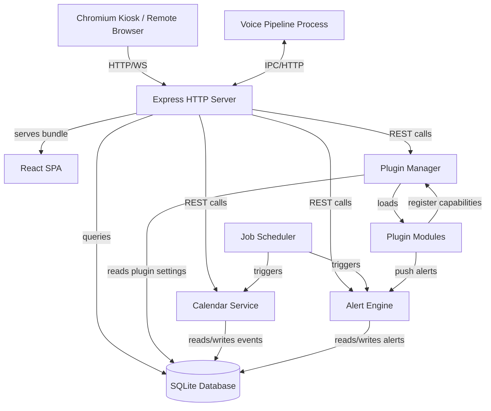

# System Architecture: Nestor

**Date:** 2026-05-08
**Architect:** Ben
**Version:** 1.0
**Project Type:** web-app
**Project Level:** 3
**Status:** Draft

---

## Document Overview

This document defines the system architecture for **Nestor** — a free, open source, self-hosted household dashboard running on a large touchscreen mounted in the home. It provides the technical blueprint for implementation, addressing all functional and non-functional requirements from the PRD.

**Related Documents:**
- Product Requirements Document: `nestor-prd.md`
- Product Brief: _(not yet produced)_

---

## Executive Summary

Nestor is a **Modular Monolith** web application served locally from a mini PC or Raspberry Pi. A single Node.js/Express process hosts the REST API and serves a React single-page application, which Chromium loads in kiosk mode on the attached touchscreen. All household data lives in a local SQLite database — nothing is stored externally. A separate, lightweight voice pipeline process handles wake word detection, speech-to-text, and text-to-speech entirely offline.

The plugin system allows third-party device and service integrations to be loaded as Node.js modules without modifying core. Each plugin declares its capabilities via a manifest; the Plugin Manager mediates all cross-plugin and core interactions.

Key architectural decisions:
- **SQLite** over a server database — zero-config, single-file backup, more than sufficient for a household workload
- **Modular Monolith** over microservices — single-device deployment, low resource footprint, no network overhead
- **React SPA** over server-side rendering — SEO is irrelevant for a LAN app; SPA gives rich interactivity and offline-friendly behaviour
- **Separate voice process** — isolates native module dependencies (Whisper, OpenWakeWord) and prevents a crash from affecting the core server
- **Tailscale for remote access** — zero changes to core; VPN handles security entirely

---

## Architectural Drivers

These requirements most heavily influence architectural decisions:

| # | Driver | Source | Architectural Impact |
|---|--------|--------|---------------------|
| AD-01 | **Local-first / No cloud backend** | PRD §2 | SQLite on-device; no hosted DB; Tailscale for remote access |
| AD-02 | **24/7 low-maintenance reliability** | PRD §2 | systemd auto-restart; SQLite WAL mode; plugin isolation |
| AD-03 | **Touch-optimised kiosk UX** | PRD §6 | React SPA served locally; Chromium kiosk; OS keyboard phase 1 |
| AD-04 | **Plugin extensibility** | PRD §31 | Manifest-driven plugin system; capability registry; sandboxed modules |
| AD-05 | **Multi-profile with complex permissions** | PRD §5 | Profile-scoped API middleware; PIN auth; per-profile React routing |
| AD-06 | **Local voice pipeline (no cloud audio)** | PRD §22 | Separate voice process; Whisper + Piper + OpenWakeWord; IPC to Express |
| AD-07 | **Internationalisation from day one** | PRD §26 | i18next throughout; all strings externalised; locale settings table |
| AD-08 | **Approachable installation** | PRD §29 | Bash install script; systemd service setup; first-boot wizard in React |
| AD-09 | **Performance at distance (1–2m legibility)** | PRD §6 | React lazy loading; efficient re-renders; in-memory settings cache |
| AD-10 | **Highly configurable household profiles** | PRD §5, §30 | `app_settings` key-value store; per-profile flags; all features toggleable |

---

## System Overview

### High-Level Architecture

```
┌─────────────────────────────────────────────────────────┐
│                     Ubuntu 24 LTS Host                   │
│                                                          │
│  ┌──────────────┐         ┌────────────────────────────┐ │
│  │   Chromium   │ HTTP    │   Express HTTP Server      │ │
│  │  Kiosk Mode  │◄───────►│   • Serves React SPA       │ │
│  │  (localhost) │         │   • REST API /api/v1/      │ │
│  └──────────────┘         │   • Plugin API bridge      │ │
│                           │   • CalDAV sync scheduler  │ │
│  ┌──────────────┐  IPC    │   • Alert aggregator       │ │
│  │ Voice Pipeline│◄───────►│                            │ │
│  │ (child proc) │         └────────────┬───────────────┘ │
│  │ • OpenWakeWord│                     │                  │
│  │ • Whisper STT │              ┌──────▼──────┐           │
│  │ • Piper TTS   │              │   SQLite DB  │           │
│  └──────────────┘              │  (WAL mode)  │           │
│                                └─────────────┘           │
│  ┌──────────────────────────────────────────────────────┐ │
│  │                    Plugin Modules                     │ │
│  │   /plugins/tesla/  /plugins/eufy/  /plugins/ai/  ... │ │
│  └──────────────────────────────────────────────────────┘ │
└─────────────────────────────────────────────────────────┘
         │ Tailscale (optional)    │ External APIs (opt-in)
         ▼                         ▼
    Remote browsers           Google CalDAV
                              Open-Meteo
                              Gemini AI
                              Tesla API
                              Eufy API
```

### Architecture Diagram — Component Interaction



### Architectural Pattern

**Pattern:** Modular Monolith with Isolated Voice Subprocess

**Rationale:**
Nestor runs on a single low-power device (Intel NUC or Raspberry Pi 5) with no horizontal scaling requirement. A distributed architecture would add network overhead, deployment complexity, and resource cost with no benefit. The modular monolith enforces clear module boundaries — one module per product domain — while keeping deployment simple (a single `npm start`). The voice pipeline is extracted as a separate process solely to isolate native module dependencies (Whisper, OpenWakeWord use native bindings) and ensure a voice crash cannot affect core functionality.

---

## Technology Stack

### Frontend

**Choice:** React 18 (SPA, TypeScript)

**Rationale:** React is already specified in the PRD and is the right choice for a complex, stateful UI with many interactive modules. TypeScript adds type safety critical for a large codebase with many contributors. The SPA model is appropriate — SEO is irrelevant for a LAN-served application, and the rich client-side interactivity (drag-and-drop, animations, touch gestures) maps well to React.

**Key libraries:**
- `react-router-dom` v6 — client-side routing per module/profile
- `i18next` + `react-i18next` — internationalisation
- `react-query` (TanStack Query) — server state, caching, background refetch
- `zustand` — lightweight client state (profile, settings, alert count)
- `framer-motion` — animations (spring, carousel, completion bursts)
- `react-hook-form` — form management throughout
- `date-fns` — locale-aware date/time formatting
- `react-virtualized` — long list performance (shopping list, logs)

**Trade-offs:** React adds bundle size vs. vanilla JS, but the developer ecosystem and component reuse across 10+ nav modules easily justifies it.

---

### Backend

**Choice:** Node.js 20 LTS + Express 4

**Rationale:** Already specified in PRD. Node.js is the right choice for an I/O-bound application (CalDAV sync, plugin HTTP calls, file I/O for photos). Single language across frontend and backend reduces context switching for contributors. Express is minimal and well-understood globally, keeping the barrier to community contribution low.

**Key libraries:**
- `better-sqlite3` — synchronous SQLite driver (simpler than async for a single-device app)
- `node-cron` — scheduled jobs (sync intervals, reminder checks)
- `node-caldav-adapter` + `tsdav` — CalDAV client for Google/Apple/Yahoo
- `cheerio` + Schema.org parser — recipe URL scraping
- `ical.js` — iCal parsing
- `bcrypt` — PIN hashing
- `aes-256-gcm` (Node.js `crypto`) — credential encryption at rest
- `multer` — photo/document uploads
- `ws` — WebSocket for real-time alert push to frontend
- `axios` — HTTP client for external API calls (weather, plugins)

**Trade-offs:** Node.js single-threaded event loop is a good fit for this I/O-bound workload. CPU-intensive tasks (Whisper STT, image processing) are offloaded to the separate voice process or worker threads.

---

### Database

**Choice:** SQLite 3 (WAL mode) via `better-sqlite3`

**Rationale:** Already specified in PRD and is the correct choice. A household dashboard on a single device will never approach SQLite's practical limits (~100GB, thousands of rows across all tables). SQLite requires zero administration, is a single file (trivial backup — just copy it), and is battle-tested for 24/7 embedded use. WAL (Write-Ahead Logging) mode enables concurrent readers with a single writer, which is sufficient for this workload.

**Configuration:**
- WAL mode enabled at startup: `PRAGMA journal_mode=WAL`
- Foreign keys enforced: `PRAGMA foreign_keys=ON`
- Migrations via numbered SQL files (`migrations/001_initial.sql`, `002_add_pets.sql`, etc.)
- Periodic `VACUUM` via scheduler (weekly, off-peak)
- Database file: `~/.nestor/nestor.db` (outside app directory for update safety)

**Trade-offs:** SQLite does not support multiple write connections from separate processes. The voice process communicates with the main process via HTTP/IPC rather than directly accessing the database.

---

### Infrastructure

**Choice:** Ubuntu 24 LTS + systemd + Chromium kiosk

**Rationale:** Specified in PRD. systemd provides robust service management with automatic restart, dependency ordering, and logging via journald. No Docker required — adds complexity and resource overhead not justified for a single-service local app. Chromium kiosk mode is the standard approach for Linux-based touchscreen dashboards.

**systemd services:**
```
nestor-server.service    — Node.js Express server (starts on boot, restarts on failure)
nestor-kiosk.service     — Chromium in kiosk mode (depends on nestor-server)
nestor-voice.service     — Voice pipeline process (optional, starts if audio hardware detected)
```

**Remote access:** Tailscale (optional) — zero application changes, VPN tunnels all traffic, no port forwarding, no cloud backend. Setup documented as an optional step in the installation guide.

**Photo sync:** Syncthing (optional) — syncs screensaver photo folder from user's phone/NAS.

**Trade-offs:** No Docker means the install script must handle Node.js version management (via nvm) and OS-level dependencies. Accepted — keeps resource usage low and the setup approachable.

---

### Third-Party Services

All external service connections are **opt-in** and clearly documented to the user during setup.

| Service | Purpose | Auth method | Data sent |
|---------|---------|------------|-----------|
| Open-Meteo | Weather data | None (free, no key) | Lat/lon coordinates |
| Google Calendar | CalDAV sync | OAuth2 + CalDAV | None (pull only) |
| Apple iCloud Calendar | CalDAV sync | App-specific password + CalDAV | None (pull only) |
| Yahoo Calendar | CalDAV sync | CalDAV endpoint | None (pull only) |
| Tailscale | Remote VPN access | Tailscale auth key | Encrypted tunnel only |
| Syncthing | Photo folder sync | Device pairing | Encrypted file sync |
| GitHub Releases API | Update checks | None | None (version poll only) |
| **Plugin: Gemini AI** | Conversational AI | API key | Transcribed text (not audio) |
| **Plugin: Tesla API** | EV status | OAuth2 tokens | None (pull only) |
| **Plugin: Eufy** | Camera/vacuum | Account credentials | None (pull only) |

---

### Development & Deployment

**Version control:** Git (GitHub, MIT licence)

**CI/CD:** GitHub Actions
- PR checks: TypeScript compile, ESLint, Prettier, unit tests
- Release: tag push → build → create GitHub Release with install script checksum

**Testing:**
- Unit: Jest + React Testing Library (target: 80% coverage on business logic)
- Integration: Supertest against Express routes with in-memory SQLite
- E2E: Playwright (key flows: setup wizard, profile switch, event add, alert dismiss)

**Code style:** ESLint (Airbnb config), Prettier, Husky pre-commit hooks

**Monitoring:** journald logs (accessible via `journalctl -u nestor-server`). Future: optional structured JSON logging to file.

---

## System Components

### Component 1: Express HTTP Server

**Purpose:** Single entry point. Serves the React SPA bundle and hosts the REST API.

**Responsibilities:**
- Static file serving (React build output)
- REST API routing to domain service modules
- Profile-aware request middleware (reads `X-Profile-Id` header, validates PIN for admin ops)
- WebSocket server for real-time alert push
- Plugin API bridge (routes plugin-registered endpoints)
- Multipart upload handling for photos and documents

**Interfaces:**
- HTTP REST: `http://localhost:3000/api/v1/`
- WebSocket: `ws://localhost:3000/ws` (alert push, voice status)
- Static: `http://localhost:3000/` (React SPA)

**Dependencies:** Data Layer, Plugin Manager, Alert Engine

**FRs addressed:** All — every client interaction flows through this component.

---

### Component 2: Plugin Manager

**Purpose:** Loads, validates, and manages the lifecycle of all plugins.

**Responsibilities:**
- Discover plugins in `/plugins` directory on startup
- Parse and validate `manifest.json` for each plugin
- Register plugin capabilities with the core capability registry
- Expose plugin API surface (widgets, alert sources, voice handlers, nav modes, transport adapters)
- Provide plugin settings storage/retrieval via SQLite `plugin_settings` table
- Isolate plugin errors (try/catch wrappers on all plugin calls)
- Handle plugin enable/disable at runtime without restart

**Interfaces:**
- Internal API: `PluginManager.getCapability(pluginId, capabilityName)`
- Plugin receives: `NestorPluginContext` object with access to DB (read-only), alert push, TTS queue, settings CRUD

**Dependencies:** Data Layer, Alert Engine, Voice Pipeline (TTS queue)

**FRs addressed:** FR-Plugin-001 through FR-Plugin-010 (all plugin system requirements)

---

### Component 3: Calendar Service

**Purpose:** CalDAV synchronisation and calendar event management.

**Responsibilities:**
- CalDAV account management (add, test, remove accounts)
- OAuth2 token refresh for Google
- Scheduled sync (configurable interval, default 15 minutes)
- Parse iCal/CalDAV responses into normalised `calendar_events` schema
- Recurring event expansion (RRULE parsing via ical.js)
- Term dates import (iCal URL subscription)
- Write local events back to CalDAV providers
- Conflict detection for vehicle bookings

**Interfaces:**
- REST: `/api/v1/calendar/*`
- Internal: `CalendarService.getEventsForRange(profileId, startDate, endDate)`

**Dependencies:** Data Layer, Job Scheduler (for sync triggers)

**FRs addressed:** FR-Cal-001 to FR-Cal-010

---

### Component 4: Voice Pipeline Process

**Purpose:** Entirely local voice interaction — wake word, speech-to-text, command routing, text-to-speech.

**Responsibilities:**
- Continuous audio capture from USB mic
- Wake word detection via OpenWakeWord (custom wake word, ~30 samples)
- Triggered speech-to-text via OpenAI Whisper (local model, tiny/base)
- Transcribed text sent to core Voice Command Router via HTTP POST to Express
- Receives TTS text from Express, synthesises via Piper TTS, plays via USB speaker
- Visual "listening" status broadcast via WebSocket
- Respects "quiet hours" setting (polls `app_settings` before TTS output)

**Why separate process:** Native bindings (Whisper, OpenWakeWord) are complex C++ extensions. Isolating them means a crash in the voice layer never affects the core server. The Python-based OpenWakeWord may be run as a Python subprocess managed by the Node.js voice process.

**Interfaces:**
- HTTP POST to Express: `POST /internal/voice/command { transcript, confidence }`
- HTTP GET from Express: `GET /internal/voice/tts { text, voiceId }`
- WebSocket: broadcasts `{ type: "voice_status", status: "listening|idle|speaking" }`

**Dependencies:** Express HTTP Server (IPC), audio hardware (USB mic/speaker)

**FRs addressed:** FR-Voice-001 to FR-Voice-008

---

### Component 5: Alert Engine

**Purpose:** Aggregates, deduplicates, and surfaces dismissible alerts from all modules and plugins.

**Responsibilities:**
- Receive alert push from all domain modules (bin day, MOT due, pet vaccination, etc.)
- Receive alert push from plugins (EV charge low, doorbell ring, etc.)
- Persist alerts to `alerts` table (severity, source, message, dismissed state)
- Deduplicate same-day re-alerts
- Compute nav mode badge counts
- Push new alerts to connected browsers via WebSocket
- Optional audio chime per alert category (configurable)

**Interfaces:**
- Internal: `AlertEngine.push({ source, type, severity, message, profileId? })`
- REST: `GET /api/v1/alerts`, `POST /api/v1/alerts/:id/dismiss`
- WebSocket: broadcasts `{ type: "alert_update", alerts: [...] }`

**Dependencies:** Data Layer, Job Scheduler (for periodic alert checks), Plugin Manager (receives plugin alerts)

**FRs addressed:** FR-Alert-001 to FR-Alert-013

---

### Component 6: Job Scheduler

**Purpose:** Cron-based background work — sync, reminders, and periodic maintenance.

**Responsibilities:**
- CalDAV sync trigger (every N minutes, configurable)
- Reminder evaluation (MOT, pet vaccinations, finance end dates, bin day, meter readings) — runs nightly
- Weather data refresh (every 30 minutes)
- GitHub Releases API poll for updates (nightly)
- SQLite VACUUM (weekly, 03:00)
- Alert evaluation for the next 24 hours (runs on schedule and on app event)
- Baby tracking log overdue checks (if tracking active)

**Interfaces:**
- Internal: `Scheduler.registerJob(cronExpression, handler)`
- Reads: `app_settings` for configurable intervals

**Dependencies:** Data Layer, Calendar Service, Alert Engine, External APIs

**FRs addressed:** Supporting component for most FRs requiring proactive notifications

---

### Component 7: React SPA

**Purpose:** The entire user interface — all 10 nav modes, profile switching, setup wizard, and admin settings.

**Responsibilities:**
- Client-side routing (React Router) per nav mode and per profile
- Profile context provider (active profile, permissions, colour)
- i18next integration — all strings localised
- TanStack Query for server state (API calls with caching and background refresh)
- Zustand store for transient client state (profile, alert count, voice status)
- Portrait/landscape layout adaptation (CSS Grid, Tailwind breakpoints, orientation media query)
- Touch event handling (swipe carousel, tap targets, long press alternatives)
- Animation system (Framer Motion — spring, carousel, completion bursts)
- Per-profile permission guards on all routes/components
- Screensaver (Ken Burns photo slideshow, idle timer)
- On-screen keyboard integration (Phase 1: triggers OS Onboard; Phase 2: custom React keyboard)

**Module structure (one per nav section + core):**
```
src/
  core/           — Profile context, auth, settings, alert strip, nav bar
  home/           — Day carousel, weather widget, journey time, plugin strip
  calendar/       — Day/week/month views, event CRUD
  food/           — Meal planner, recipe library, shopping list
  vehicles/       — Vehicle profiles, booking calendar, fuel log
  family/         — Children profiles, chores, rewards, health log, routines
  house/          — Chores rota, bin day, maintenance, subscriptions, budget
  finance/        — Agreements, commitments summary, savings goals
  pets/           — Pet profiles, health/vaccination log, vet appointments
  ev/             — Charging log, energy overview (core only; Tesla via plugin)
  board/          — Message board, whiteboard, countdowns, lists
  contacts/       — Contact directory
  admin/          — All settings panels, setup wizard, plugin management
  plugins/        — Dynamic plugin widget and nav mode injection
  shared/         — Design system components, hooks, utilities
```

**Dependencies:** Express API (via fetch/TanStack Query), WebSocket (alert/voice status)

---

### Component 8: Data Layer

**Purpose:** All database access — repository pattern per domain entity.

**Responsibilities:**
- SQLite connection management (single connection, WAL mode, foreign keys)
- Migration runner on startup (numbered SQL files, tracks applied migrations)
- Repository classes per domain (ProfileRepository, EventRepository, RecipeRepository, etc.)
- Parameterised queries throughout (SQL injection prevention)
- Transaction support for multi-table writes
- Encryption/decryption of sensitive fields (CalDAV credentials, plugin API keys) using AES-256-GCM with a machine-specific key derived from device hardware ID

**Dependencies:** SQLite file on disk

---

### Component 9: Setup Wizard

**Purpose:** First-boot guided setup, fully accessible from Settings > Setup & Help.

**Responsibilities:**
- 10-step guided onboarding (language → locale → profiles → calendars → display → orientation → voice → features → plugins → done)
- Progress tracking in `app_settings` (which steps are complete/partial/skipped)
- QR code OAuth flow for Google Calendar (avoids typing long URLs on touchscreen)
- Wake word sample recording UI (20–30 samples, progress indicator)
- Completion indicators per step (✅ ⚠️ ○)

**Implementation:** React component within the admin module, rendered full-screen on first boot (detected by `app_settings.setup_complete = false`).

---

## Data Architecture

### Data Model

**Core Entities:**

```
profiles
  id, name, type (baby|toddler|child|teen|grandparent|guest|admin),
  colour, pin_hash, avatar_path, accessibility_json, permissions_json,
  text_size, simplified_nav, created_at

calendar_events
  id, title, start_datetime, end_datetime, all_day, profile_id,
  source (local|caldav), caldav_uid, caldav_etag, account_id,
  type (default|wfh|shift|nursery_drop|vehicle_booking|vet|custody),
  recurring_rule, colour_override, notes, created_at

calendar_accounts
  id, provider (google|apple|yahoo|custom), display_name,
  caldav_url, credentials_encrypted, sync_interval_mins,
  last_sync_at, profile_id, active

meal_plan
  id, plan_date, slot_name, recipe_id (nullable), free_text (nullable),
  servings_override

recipes
  id, title, description, prep_mins, cook_mins, servings, tags_json,
  photo_path, source_url, created_at
  
recipe_ingredients
  id, recipe_id, quantity, unit, ingredient, notes, sort_order

shopping_items
  id, name, quantity, unit, category, ticked, added_by_profile_id,
  pending_approval, created_at

vehicles
  id, name, nickname, type (car|van|motorcycle|bicycle|other),
  colour, registration, fuel_type, mot_date, service_date, service_mileage,
  tax_date, insurance_date, breakdown_date, active

vehicle_bookings
  id, vehicle_id, profile_id, start_datetime, end_datetime, notes

fuel_logs
  id, vehicle_id, log_date, litres, cost, mileage, odometer, notes

pets
  id, name, species, breed, dob, photo_path, microchip, insurance_details,
  vet_contact_id, feeding_notes, grooming_notes, active

pet_health_logs
  id, pet_id, log_type (vaccination|flea|worming|weight|medication|note|vet_visit),
  log_date, value, unit, notes, next_due_date, reminder_days_before

chores
  id, name, profile_id, frequency (daily|weekly|monthly|custom), custom_days,
  reward_points, active, last_done_at, sort_order

chore_completions
  id, chore_id, profile_id, completed_at, points_awarded

reward_redemptions
  id, profile_id, description, points_spent, redeemed_at

finance_agreements
  id, type (car_finance|loan|bnpl|mortgage|other), name, lender,
  monthly_payment, remaining_balance, end_date, balloon_payment,
  fixed_rate_end_date, alert_months_before, notes

subscriptions
  id, name, monthly_cost, renewal_date, category, trial_end_date,
  alert_days_before, active

home_maintenance
  id, title, type (job|warranty|reminder), completed_date, next_due_date,
  cost, contact_id, landlord_report, notes, renter_mode

meter_readings
  id, fuel_type (electricity|gas|oil|water), reading_date, value, unit,
  cost_per_unit, notes

contacts
  id, name, role, phone, category (medical|school|pets|home|emergency|family|trade),
  notes, linked_vehicle_id, linked_pet_id

checklists
  id, name, type (daily_reset|trip|one_off|recurring), auto_reset_cron,
  template_id, last_reset_at, guest_name, guest_arrival_date

checklist_items
  id, checklist_id, text, ticked, sort_order, section

alerts
  id, source_module, alert_type, severity (urgent|warning|info|success),
  message, profile_id (nullable), dismissed, dismissed_at, created_at,
  nav_mode_badge

app_settings
  key (unique), value, updated_at

bin_schedules
  id, name, colour, icon, day_of_week (0-6), frequency_weeks,
  anchor_date, bank_holiday_shift, reminder_evening_before,
  reminder_morning_of, audio_chime, active

health_logs
  id, profile_id, log_type (temperature|symptom|medicine|mood|weight|growth),
  log_datetime, value, unit, notes

board_messages
  id, profile_id, content, colour, pinned, dismissed, created_at

whiteboard_snapshots
  id, name, image_path, created_at

countdown_timers
  id, name, target_date, profile_id (nullable), show_on_home

savings_goals
  id, name, target_amount, current_amount, currency, linked_countdown_id

voice_command_log
  id, transcript, matched_handler (core|plugin_id|unmatched),
  response_text, timestamp

plugin_settings
  plugin_id, key, value_encrypted, updated_at

ev_charging_log
  id, vehicle_id, session_date, kwh, cost, location (home|supercharger|other),
  notes
```

**Relationships summary:**
- `profiles` → many `calendar_events`, `chores`, `health_logs`, `board_messages`, `chore_completions`
- `recipes` → many `recipe_ingredients`; `meal_plan` references `recipes`
- `vehicles` → many `vehicle_bookings`, `fuel_logs`, `ev_charging_log`
- `pets` → many `pet_health_logs`; references `contacts` (vet)
- `checklists` → many `checklist_items`
- `finance_agreements` and `subscriptions` are independent flat tables
- `calendar_accounts` → many `calendar_events` (sync source)

---

### Database Design

**Indexes (key):**
```sql
CREATE INDEX idx_events_profile_date ON calendar_events(profile_id, start_datetime);
CREATE INDEX idx_events_account ON calendar_events(account_id);
CREATE INDEX idx_chore_completions_profile ON chore_completions(profile_id, completed_at);
CREATE INDEX idx_alerts_dismissed ON alerts(dismissed, created_at);
CREATE INDEX idx_health_logs_profile ON health_logs(profile_id, log_datetime);
CREATE INDEX idx_pet_health_next_due ON pet_health_logs(next_due_date) WHERE next_due_date IS NOT NULL;
CREATE INDEX idx_shopping_ticked ON shopping_items(ticked);
```

**Migration strategy:** Numbered SQL files in `server/migrations/`. On startup, the migration runner queries `applied_migrations` table and runs any unapplied files in order. Migrations are append-only — no destructive changes to existing columns without a data-safe migration pair.

**Backup:** Single file copy of `~/.nestor/nestor.db`. Export/import JSON backup available from Admin > System. Documented manual backup procedure in README.

---

### Data Flow

**Read path (typical page load):**
```
React component mounts
  → TanStack Query checks cache (fresh? return cached)
  → If stale: GET /api/v1/{resource}
  → Express middleware validates profile/permissions
  → Repository queries SQLite (parameterised)
  → JSON response
  → TanStack Query caches, React re-renders
```

**Write path:**
```
User interaction (tap, form submit)
  → POST/PATCH /api/v1/{resource}
  → Express validates input (zod schemas)
  → Service layer executes business logic
  → Repository writes to SQLite (transaction if multi-table)
  → TanStack Query cache invalidated
  → If alert-generating: AlertEngine.push() → WebSocket broadcast
  → 200/201 response → UI optimistic update confirmed
```

**CalDAV sync path:**
```
Scheduler triggers (every N mins)
  → CalendarService.syncAccount(accountId)
  → tsdav fetches changed events since last etag
  → Parse iCal → normalise to calendar_events schema
  → Upsert by caldav_uid (INSERT OR REPLACE)
  → Update last_sync_at
  → WebSocket broadcast { type: "calendar_updated" }
  → React refetches affected date range
```

---

## API Design

### API Architecture

**Style:** REST, JSON request/response
**Base path:** `/api/v1/`
**Auth:** Profile-based, not user-account-based
- All requests include `X-Profile-Id: {profileId}` header (set by React on profile switch)
- Admin operations additionally require `X-Admin-Pin: {pin}` header (hashed server-side against stored bcrypt hash)
- No JWTs, no sessions — the app is LAN-only; Tailscale handles external access security
**Versioning:** Path-based (`/v1/`). Breaking changes increment version.
**Error format:** `{ error: string, code: string, details?: object }`
**Real-time:** WebSocket at `/ws` for alert push and voice status (no polling required)

---

### Key Endpoints

#### Profiles & Auth
```
GET    /api/v1/profiles                     — List all profiles
POST   /api/v1/profiles                     — Create profile (admin)
PATCH  /api/v1/profiles/:id                 — Update profile (admin)
DELETE /api/v1/profiles/:id                 — Delete profile (admin)
POST   /api/v1/profiles/:id/verify-pin      — Validate PIN, returns { valid: bool }
GET    /api/v1/profiles/:id/permissions     — Get permission set
```

#### Settings
```
GET    /api/v1/settings                     — All app_settings as key-value map
PATCH  /api/v1/settings                     — Batch update settings (admin)
GET    /api/v1/settings/locale              — Locale settings object
PATCH  /api/v1/settings/locale              — Update locale settings
```

#### Calendar
```
GET    /api/v1/calendar/events              — Events in range (?start=&end=&profileIds=)
POST   /api/v1/calendar/events              — Create event
PATCH  /api/v1/calendar/events/:id          — Update event
DELETE /api/v1/calendar/events/:id          — Delete event
GET    /api/v1/calendar/accounts            — List CalDAV accounts
POST   /api/v1/calendar/accounts            — Add CalDAV account
POST   /api/v1/calendar/accounts/:id/sync   — Trigger manual sync
DELETE /api/v1/calendar/accounts/:id        — Remove account
```

#### Food
```
GET    /api/v1/meal-plan                    — Week plan (?weekStart=)
PATCH  /api/v1/meal-plan/:date/:slot        — Set meal for slot
GET    /api/v1/recipes                      — List recipes (?search=&tags=)
POST   /api/v1/recipes                      — Create recipe
PATCH  /api/v1/recipes/:id                  — Update recipe
DELETE /api/v1/recipes/:id                  — Delete recipe
POST   /api/v1/recipes/import-url           — Scrape recipe from URL
GET    /api/v1/shopping-list                — Current shopping list
POST   /api/v1/shopping-list                — Add item
PATCH  /api/v1/shopping-list/:id            — Update item (tick/untick)
DELETE /api/v1/shopping-list/ticked         — Clear all ticked items
```

#### Vehicles
```
GET    /api/v1/vehicles                     — List vehicles
POST   /api/v1/vehicles                     — Add vehicle
PATCH  /api/v1/vehicles/:id                 — Update vehicle
GET    /api/v1/vehicles/:id/bookings        — Bookings for vehicle (?range=)
POST   /api/v1/vehicles/:id/bookings        — Create booking
DELETE /api/v1/vehicles/:id/bookings/:bookId— Cancel booking
POST   /api/v1/vehicles/:id/fuel-log        — Log fuel fill-up
GET    /api/v1/vehicles/:id/fuel-log        — Fuel history
```

#### Family
```
GET    /api/v1/chores                       — Chores (?profileId=)
POST   /api/v1/chores                       — Create chore
PATCH  /api/v1/chores/:id/complete          — Mark chore done (awards points)
GET    /api/v1/rewards/:profileId           — Reward balance + log
POST   /api/v1/rewards/:profileId/redeem    — Redeem points
GET    /api/v1/health-log/:profileId        — Health log entries
POST   /api/v1/health-log/:profileId        — Add health log entry
```

#### House
```
GET    /api/v1/bin-schedules                — All bin configurations
POST   /api/v1/bin-schedules               — Add bin type
PATCH  /api/v1/bin-schedules/:id            — Update bin config
GET    /api/v1/bin-schedules/upcoming       — Next collection dates (?days=14)
GET    /api/v1/subscriptions                — All subscriptions
POST   /api/v1/subscriptions                — Add subscription
GET    /api/v1/maintenance                  — Maintenance log
POST   /api/v1/maintenance                  — Add maintenance item
GET    /api/v1/meter-readings               — Meter reading history (?fuelType=)
POST   /api/v1/meter-readings               — Add meter reading
```

#### Finance
```
GET    /api/v1/finance/agreements           — All finance agreements
POST   /api/v1/finance/agreements           — Add agreement
PATCH  /api/v1/finance/agreements/:id       — Update agreement
GET    /api/v1/finance/summary              — Monthly committed outgoings summary
GET    /api/v1/finance/savings              — Savings goals list
POST   /api/v1/finance/savings              — Add savings goal
PATCH  /api/v1/finance/savings/:id          — Update savings goal amount
```

#### Pets
```
GET    /api/v1/pets                         — All pet profiles
POST   /api/v1/pets                         — Add pet
GET    /api/v1/pets/:id/health-log          — Pet health history
POST   /api/v1/pets/:id/health-log          — Add health log entry
GET    /api/v1/pets/:id/upcoming-care       — Next due dates (vaccinations, flea, etc.)
```

#### Alerts
```
GET    /api/v1/alerts                       — Current active alerts
POST   /api/v1/alerts/:id/dismiss           — Dismiss alert
GET    /api/v1/alerts/badge-counts          — Badge count per nav mode
```

#### Board
```
GET    /api/v1/board/messages               — Active board messages
POST   /api/v1/board/messages               — Post message
PATCH  /api/v1/board/messages/:id/dismiss   — Dismiss message
GET    /api/v1/board/countdowns             — Countdown timers
POST   /api/v1/board/countdowns             — Add countdown
GET    /api/v1/contacts                     — All contacts (?category=)
POST   /api/v1/contacts                     — Add contact
```

#### Plugins
```
GET    /api/v1/plugins                      — List plugins + status
POST   /api/v1/plugins/:id/enable           — Enable plugin (admin)
POST   /api/v1/plugins/:id/disable          — Disable plugin (admin)
GET    /api/v1/plugins/:id/settings         — Plugin settings
PATCH  /api/v1/plugins/:id/settings         — Update plugin settings
```

#### Voice (Internal)
```
POST   /internal/voice/command              — Receive STT transcript from voice process
POST   /internal/voice/tts                  — Queue TTS text to voice process
GET    /internal/voice/status               — Voice process health
```

#### System
```
GET    /api/v1/system/version               — Current version + update available
POST   /api/v1/system/update                — Trigger update (admin)
POST   /api/v1/system/backup                — Trigger JSON export
GET    /api/v1/weather                      — Current weather + 5-day (?lat=&lon=)
```

---

### Authentication & Authorization

**Profile switching:**
- React stores `activeProfileId` in Zustand and localStorage
- All API requests include `X-Profile-Id` header
- Express middleware resolves profile and attaches `req.profile`

**Permission enforcement:**
- `req.profile.permissions` checked in route middleware before controller executes
- Permission set loaded from `profiles.permissions_json` at profile load time
- Admin routes additionally require `X-Admin-Pin` validated against bcrypt hash
- Child/teen routes filter response data to profile-scoped records only

**Credential security:**
- CalDAV OAuth tokens and credentials stored encrypted in SQLite (AES-256-GCM)
- Encryption key derived from a machine-specific identifier (e.g., `/etc/machine-id`) + app secret in `app_settings`
- Plugin API keys stored in `plugin_settings` with same encryption
- PINs stored as bcrypt hashes (cost factor 10)
- No credentials ever logged or included in API responses

---

## Non-Functional Requirements Coverage

### NFR-001: Local-first / Data Privacy

**Requirement:** All core household data stored on-device. No data sent to external services without explicit user consent. No central Nestor servers.

**Architecture Solution:**
- SQLite database at `~/.nestor/nestor.db` — never leaves the device
- All third-party connections (CalDAV, weather, AI plugin) are opt-in, disclosed during setup, and clearly listed in Settings > Connections
- No analytics, no telemetry, no usage reporting
- Update checks are a simple version number poll to GitHub Releases API — no device ID or data included
- Tailscale for remote access — VPN, no proxy, Nestor never sees external traffic
- Gemini AI plugin: sends only transcribed text (not audio), disclosed during plugin install

**Implementation Notes:**
- Network requests in the codebase must be audited pre-release — no undisclosed outbound calls
- Plugin manifests must declare `apiRisk` and data sent — reviewed before listing in community directory

**Validation:** Network audit tool in CI; manual review checklist for each release.

---

### NFR-002: 24/7 Low-Maintenance Reliability

**Requirement:** Runs continuously with minimal intervention. Target: >99% uptime over a 30-day period.

**Architecture Solution:**
- systemd `nestor-server.service` with `Restart=always`, `RestartSec=5`
- SQLite WAL mode prevents database corruption on sudden power loss
- Plugin crash isolation: all plugin calls wrapped in try/catch; a plugin error logs and disables the plugin but does not crash the server process
- Graceful shutdown handler: SIGTERM drains in-flight requests, closes SQLite connection cleanly
- Health check endpoint (`GET /health`) for external monitoring (Uptime Kuma, etc.)
- Weekly SQLite VACUUM at 03:00 to prevent fragmentation
- In-app update mechanism retains previous version for rollback

**Implementation Notes:**
- All async operations must handle rejection (no unhandled promise rejections — these crash Node.js)
- Use `process.on('uncaughtException', ...)` as last-resort logger (log + graceful restart, not silent swallow)
- systemd `WatchdogSec=30` for deadlock detection

**Validation:** 30-day continuous uptime test on reference hardware (Intel NUC i3 / Raspberry Pi 5).

---

### NFR-003: Touch Performance

**Requirement:** Touch response < 100ms perceived latency; animations at 60fps; carousel swipe smooth.

**Architecture Solution:**
- React 18 concurrent rendering — time-slices non-urgent updates
- Framer Motion layout animations — GPU-accelerated CSS transforms only (no layout-triggering properties)
- TanStack Query: stale-while-revalidate — UI never blocks waiting for API response
- Virtualized lists for long scrollable content (shopping list, recipe library, health logs)
- Lazy-loaded route modules — only the active nav mode's code is loaded
- Touch event handlers use `passive: true` where scroll is not prevented
- No `setTimeout` or artificial delays in touch handlers
- Chromium kiosk launched with `--disable-pinch` and appropriate flags to prevent accidental browser gestures

**Implementation Notes:**
- Profile Lighthouse in development; target: Performance score > 90 on localhost
- Test carousel swipe on actual touchscreen hardware — simulator is insufficient

**Validation:** Manual testing on reference touchscreen hardware; Lighthouse CI on each PR.

---

### NFR-004: Plugin Isolation

**Requirement:** A misbehaving or crashing plugin must not crash the core server or degrade the primary UI.

**Architecture Solution:**
- All plugin module calls wrapped in async try/catch in Plugin Manager
- Plugin errors logged with plugin ID, caught, plugin marked as `error` state in memory
- Plugin cannot directly access SQLite — must use `NestorPluginContext` read-only API
- Plugin settings stored separately in `plugin_settings` table — no access to core tables
- Plugin voice handlers receive transcripts and must return a response or throw — core router always falls through gracefully
- Plugin TTS calls queued — a slow plugin cannot block core TTS output
- Resource limits: plugins run in the same Node.js process but cannot spawn unrestricted child processes without declaring `system_access` capability (admin-approved)

**Implementation Notes:**
- Official plugins (Tesla, Eufy, AI) are integration-tested with chaos testing (random throws)
- Plugin API versioned independently — breaking changes require manifest API version bump

**Validation:** Plugin chaos tests in CI; manual crash injection testing.

---

### NFR-005: Internationalisation

**Requirement:** Global use from day one. No hardcoded English strings, date formats, currencies, or units.

**Architecture Solution:**
- `i18next` with `react-i18next` throughout React SPA — all user-facing strings in `public/locales/{lang}/translation.json`
- Backend Express also uses i18next for server-generated content (alert messages, TTS strings)
- `date-fns` with locale-aware formatting for all date/time display
- `app_settings.locale` stores: language, date_format, time_format, currency, currency_position, temperature_unit, distance_unit, volume_unit, number_format, first_day_of_week
- All locale-aware formatting centralised in `src/utils/format.ts` — no inline `toLocaleDateString` calls
- RTL: CSS logical properties used throughout (`margin-inline-start` not `margin-left`); `dir="rtl"` applied at root on RTL locale; planned Phase 2

**Implementation Notes:**
- i18n lint rule enforces no string literals in JSX
- Language packs contributed via GitHub PRs — community reviewable
- Setup wizard step 1 is language selection — before any other UI renders

**Validation:** i18n lint in CI; manual testing in French locale (good proxy for date/number format differences).

---

### NFR-006: Accessibility

**Requirement:** Usable by people of all ages and abilities. Target: WCAG 2.1 AA.

**Architecture Solution:**
- Per-profile `text_size` setting (Small / Default / Large / Extra Large) applied via CSS custom property `--base-font-size` on root
- High contrast mode: CSS class on root swaps to high-contrast token set
- Colour-blind palette option: alternative profile colour set with accessible hues
- All information conveyed by colour also conveyed by icon or text label
- All tap targets minimum 44×44px (enforced via shared `<TouchTarget>` component)
- All images have `alt` text; all form inputs have `<label>`
- Semantic HTML: `<nav>`, `<main>`, `<section>`, `<article>`, `<button>` used correctly
- ARIA roles for custom components (carousel, modal, alert strip)
- All animations respect `prefers-reduced-motion` media query
- Long press always has a tap alternative
- Swipe gestures always have button alternatives

**Implementation Notes:**
- Accessibility audit (axe-core) run on each Playwright E2E test
- Screen reader full compatibility documented as community contribution opportunity (Phase 2)

**Validation:** axe-core in Playwright tests; manual testing with system accessibility settings.

---

### NFR-007: Easy Installation

**Requirement:** Non-technical users can install Nestor in < 30 minutes from a fresh Ubuntu 24 LTS machine.

**Architecture Solution:**
- Single-line bash install script: `curl -fsSL https://get.nestor.app/install.sh | bash`
- Script installs: nvm + Node.js 20, SQLite, Chromium, Onboard, Piper TTS, Whisper, OpenWakeWord, clones repo, creates systemd services, configures kiosk mode, detects orientation, launches first-boot wizard
- First-boot wizard is a React full-screen experience — no terminal required after install
- All config stored in SQLite `app_settings` — no config files to edit manually
- In-app updates: `POST /api/v1/system/update` → pulls GitHub release, runs migrations, restarts service
- Install script is idempotent — safe to re-run if interrupted

**Implementation Notes:**
- Install script tested in CI against fresh Ubuntu 24 LTS Docker container on each release
- Script provides clear progress output and helpful error messages
- Hardware detection: script checks for USB audio device; warns if not found; recommends hardware

**Validation:** Fresh-install test on Intel NUC i3 reference hardware; time to first running wizard measured.

---

### NFR-008: Readability at Distance

**Requirement:** Key information legible at 1–2 metres without squinting.

**Architecture Solution:**
- Default base font size: 18px (larger than web standard 16px)
- Day carousel event text: minimum 20px
- Home screen time/date widget: 48–72px
- Weather temperature: 36px
- Three-level typography hierarchy enforced via design tokens
- High-density information (secondary details) revealed on tap — not shown at rest
- Card-based layout with generous padding ensures no information crowding
- Minimum contrast ratio 4.5:1 (AA) for all text

**Implementation Notes:**
- Design review at 1.5m physical distance from the reference monitor before each release
- Inter or Nunito (high legibility at small sizes and on screen) as primary typeface

**Validation:** Physical review on 24" reference monitor at 1.5m distance.

---

### NFR-009: Configurable Household Profiles

**Requirement:** Any household type — from single person to multigenerational family — can adapt Nestor to their needs without modifying code.

**Architecture Solution:**
- 7 profile types with distinct permission sets and age-appropriate UIs
- `profiles.permissions_json` allows per-profile override of any default permission
- `app_settings.enabled_nav_modes` controls which nav modes appear (stored as JSON array)
- All nav modes hideable, reorderable, renameable from Admin > Navigation
- Per-profile `simplified_nav` flag for grandparent/accessibility simplification
- Child profiles render entirely different React route trees with age-appropriate components
- `app_settings.household_type` preset (family|couple|single|shared_house) applied during wizard to sensible defaults — all overrideable

**Validation:** Scenario testing against all 8 household types defined in PRD Section 28.

---

### NFR-010: Local Voice Processing

**Requirement:** All voice audio processed on-device. No audio sent to cloud. Wake word, STT, and TTS run locally.

**Architecture Solution:**
- OpenWakeWord: Python-based, runs locally, custom wake word trained with ~30 samples
- OpenAI Whisper (open source): local model (tiny or base for Pi 5 performance, small for NUC i3); no API call
- Piper TTS: local neural TTS; multiple voice options; synthesises on-device
- Voice pipeline is a separate process that never makes outbound network calls
- Transcribed text (not audio) optionally sent to Gemini AI plugin — disclosed and opt-in
- Quiet hours: voice pipeline checks `app_settings.quiet_hours` before TTS playback

**Implementation Notes:**
- Whisper model choice configurable in admin (tiny=fastest, small=more accurate); default `base`
- Voice process watchdog in systemd — restarts on crash; core server continues without voice
- USB audio device detection at startup; voice service disabled gracefully if no hardware found

**Validation:** Voice pipeline tested offline (WiFi disabled) on reference hardware.

---

## Security Architecture

### Authentication

- **Profile PIN:** bcrypt hash (cost factor 10) stored in `profiles.pin_hash`. Admin profiles always PIN-protected; child/grandparent profiles PIN-optional (configurable)
- **Admin operations:** Require `X-Admin-Pin` header on every admin-tier API request — no session, no token — avoids session fixation on a shared-access device
- **No user accounts:** Nestor is a household device, not a multi-user SaaS. Profile switching is UX, not authentication
- **Tailscale for remote access:** All remote sessions travel through Tailscale's encrypted VPN — Nestor never terminates TLS from the internet

### Authorization

- **Profile-scoped data access:** All repository queries filter by `profile_id` where applicable. Cross-profile data access only available to admin profiles
- **Permission middleware:** Express route middleware resolves `req.profile` and checks `req.profile.permissions[routePermission]` before controller executes
- **Admin route guard:** Separate middleware validates `X-Admin-Pin` for all `/api/v1/admin/*` and sensitive operations
- **Plugin permissions:** Plugins declare required capabilities in manifest; admin must enable plugin; plugin context only exposes approved data APIs

### Data Encryption

- **Credentials at rest:** CalDAV OAuth tokens, passwords, plugin API keys stored AES-256-GCM encrypted in SQLite
- **Encryption key:** Derived from machine-specific `/etc/machine-id` + app-specific secret in `app_settings.encryption_salt` (generated once at install, never leaves device)
- **In transit:** LAN-only by default (no TLS needed for localhost); Tailscale provides TLS for all remote access; CalDAV/HTTPS to external providers
- **Photos and documents:** Stored in `~/.nestor/uploads/` — local filesystem, no encryption at rest (acceptable for home use; documented)

### Security Best Practices

- **Input validation:** All API inputs validated with `zod` schemas at route entry — no raw user data reaches the database
- **SQL injection prevention:** `better-sqlite3` parameterised queries exclusively — no string concatenation in SQL
- **XSS prevention:** React's JSX escaping by default; `dangerouslySetInnerHTML` forbidden in linting rules
- **CSRF:** Not applicable — no cookie-based auth; `X-Profile-Id` and `X-Admin-Pin` headers require JavaScript (not forgeable by cross-site form)
- **Path traversal:** Upload filenames sanitised with `sanitize-filename`; stored with UUID names, not user-provided names
- **Rate limiting:** `express-rate-limit` on PIN verification endpoints (5 attempts / 15 minutes)
- **Plugin sandboxing:** Plugin code has no access to `process.env` or Node.js internals beyond the `NestorPluginContext` API
- **Dependency audit:** `npm audit` run in CI on each PR; Dependabot enabled on GitHub repo

---

## Scalability & Performance

### Scaling Strategy

Nestor is a **single-device application** — horizontal scaling is not applicable. Vertical scaling (more RAM, faster CPU) is the upgrade path if a household outgrows a Raspberry Pi 5. The architecture is designed to run comfortably on:
- **Minimum:** Raspberry Pi 5 (4GB) — core features, Whisper `tiny` model
- **Recommended:** Intel NUC i3 6th/7th gen — full feature set, Whisper `base` model, plugin headroom

**Resource targets on recommended hardware:**
- Server process idle: < 100MB RAM, < 2% CPU
- Server process peak (multi-user, active sync): < 300MB RAM, < 15% CPU
- Voice process idle (OpenWakeWord listening): < 150MB RAM, < 5% CPU
- Whisper STT inference: 1–3 seconds on NUC i3 (`base` model)

### Performance Optimization

- **React lazy loading:** Each nav module loaded on first navigation — initial bundle is core + home only
- **TanStack Query stale-while-revalidate:** UI always shows cached data instantly; refetches in background
- **In-memory settings cache:** `app_settings` loaded once on startup, cached in memory, invalidated on write — avoids DB round-trip on every request
- **Efficient SQLite queries:** Indexed columns for all common query patterns; `EXPLAIN QUERY PLAN` reviewed for key queries
- **Image optimisation:** Recipe/pet photos stored at max 1200px wide on upload (sharp); served with cache headers
- **WebSocket for alerts:** Eliminates polling; connected clients receive push updates instantly

### Caching Strategy

| Layer | What is cached | TTL / Invalidation |
|-------|---------------|-------------------|
| TanStack Query | API responses (events, recipes, alerts) | 30s stale, background refetch; invalidated on mutation |
| Server memory | `app_settings`, profile list, plugin registry | Invalidated on write |
| Browser | Static assets (JS bundle, fonts) | Long cache with content hash filenames |
| CDN | N/A — LAN only | — |
| Weather data | Open-Meteo response | 30 minutes (re-fetched by scheduler) |

### Load Balancing

Not applicable — single device, single process. Express serves all requests sequentially (Node.js event loop). The workload is I/O-bound and well-suited to this model.

---

## Reliability & Availability

### High Availability Design

Nestor targets the **home appliance** reliability model — always on, self-healing from failure, no manual intervention required.

- **systemd auto-restart:** `Restart=always`, `RestartSec=5` — server back up in under 10 seconds after crash
- **SQLite WAL mode:** Readers never blocked by writer; no corruption on power loss (WAL journal is crash-safe)
- **Plugin isolation:** Plugin crash logged and plugin marked error; core continues serving all non-plugin routes
- **Graceful degradation:** CalDAV sync failure → cached events shown, alert displayed; voice pipeline offline → touch-only mode continues; external API down → cached data shown

### Disaster Recovery

| Scenario | Recovery Approach |
|----------|------------------|
| Server process crash | systemd restarts within 5s — user sees brief loss |
| Power cut | SQLite WAL survives unclean shutdown; server restarts on power restore |
| Corrupt SQLite | Restore from JSON backup (Admin > System > Export/Import) |
| OS disk failure | Reinstall + restore from JSON backup or SQLite file backup to NAS/USB |
| Bad update | Previous version retained; `POST /api/v1/system/rollback` reverts to prior release |

**RPO (Recovery Point Objective):** Last JSON export / SQLite file backup (manual; user-defined frequency)
**RTO (Recovery Time Objective):** < 30 seconds for process restart; < 30 minutes for full reinstall + restore

### Backup Strategy

- **Recommended:** Automate `cp ~/.nestor/nestor.db /mnt/nas/nestor-backup-$(date +%Y%m%d).db` via cron
- **In-app:** Admin > System > Export JSON — full data export to downloadable file
- **Future:** Syncthing integration to auto-sync `~/.nestor/` to NAS (documented as community feature)

### Monitoring & Alerting

- **journald:** All process output captured by systemd; `journalctl -u nestor-server -f` for live log
- **Health endpoint:** `GET /health` returns `{ status: "ok", db: "ok", voice: "ok|offline", uptime: N }`
- **Optional:** Uptime Kuma (self-hosted) configured to poll `/health` — alerts user on Telegram/email
- **In-app:** Admin > System shows server uptime, last sync time, SQLite size, plugin status
- **Structured logging:** JSON format to `~/.nestor/logs/nestor.log` with log rotation (future: configurable in admin)

---

## Integration Architecture

### External Integrations

| Integration | Protocol | Auth | Trigger |
|-------------|---------|------|---------|
| Google Calendar | CalDAV over HTTPS | OAuth2 (token refresh) | Scheduled (15min default) |
| Apple iCloud Calendar | CalDAV over HTTPS | App-specific password | Scheduled |
| Yahoo Calendar | CalDAV over HTTPS | Username/password | Scheduled |
| Open-Meteo | HTTPS REST | None | Scheduled (30min) |
| GitHub Releases API | HTTPS REST | None | Scheduled (nightly) |
| Tailscale (optional) | WireGuard VPN | Tailscale auth key | OS-level service |
| Syncthing (optional) | P2P sync | Device pairing | Continuous |
| Gemini AI (plugin) | HTTPS REST | API key | On voice command |
| Tesla API (plugin) | HTTPS REST | OAuth2 | Polling + webhook |
| Eufy (plugin) | HTTPS + P2P | Account credentials | Polling |

### Internal Integrations

- **Plugin → Alert Engine:** `pluginContext.pushAlert({ type, severity, message })` — queued and deduplicated
- **Plugin → TTS:** `pluginContext.speak(text)` — queued to voice process
- **Plugin → Calendar:** `pluginContext.addEvent(event)` — inserts with source=plugin_id
- **Plugin → Home Screen:** Widget component registered via `pluginContext.registerWidget(component)` — rendered in plugin strip
- **Voice Process → Express:** `POST /internal/voice/command` — authenticated with internal shared secret

### Message / Event Architecture

Nestor uses a lightweight **event bus** (Node.js `EventEmitter`) within the Express process for internal cross-module communication:

```
alertEngine.emit('alert:new', alert)      → WebSocket broadcasts to clients
calendarService.emit('sync:complete')     → refreshes alert evaluation
pluginManager.emit('plugin:error', id)    → marks plugin error state
scheduler.emit('reminder:check')          → alert engine evaluates reminders
```

This is intentionally simple — no external message broker (Redis, RabbitMQ) is warranted for a single-process application.

---

## Development Architecture

### Code Organisation

```
nestor/
├── server/                     # Node.js Express backend
│   ├── src/
│   │   ├── index.ts            # Entry point, Express bootstrap
│   │   ├── routes/             # Express route handlers (one file per domain)
│   │   ├── services/           # Business logic (CalendarService, AlertEngine, etc.)
│   │   ├── repositories/       # SQLite data access (one file per entity group)
│   │   ├── middleware/          # Auth, profile validation, error handling
│   │   ├── plugins/            # Plugin Manager + NestorPluginContext
│   │   ├── scheduler/          # Job Scheduler, cron definitions
│   │   ├── voice/              # Voice Pipeline process entry + IPC handlers
│   │   └── utils/              # Encryption, logging, helpers
│   ├── migrations/             # Numbered SQL migration files
│   └── tests/                  # Jest unit + integration tests
│
├── client/                     # React SPA (TypeScript)
│   ├── src/
│   │   ├── core/               # App shell, nav, profile context, alert strip
│   │   ├── home/               # Home screen module
│   │   ├── calendar/           # Calendar module
│   │   ├── food/               # Food module
│   │   ├── vehicles/           # Vehicles module
│   │   ├── family/             # Family module
│   │   ├── house/              # House module
│   │   ├── finance/            # Finance module
│   │   ├── pets/               # Pets module
│   │   ├── ev/                 # EV module
│   │   ├── board/              # Board module
│   │   ├── contacts/           # Contacts module
│   │   ├── admin/              # Admin settings + setup wizard
│   │   ├── plugins/            # Plugin widget injection
│   │   └── shared/             # Design system: components, hooks, tokens, utils
│   ├── public/
│   │   └── locales/            # i18next translation files
│   └── tests/                  # React Testing Library + Playwright
│
├── plugins/                    # Official plugins
│   ├── tesla/
│   ├── eufy/
│   ├── garden-pal/
│   └── ai-assistant/
│
├── install/                    # Install script + systemd service templates
└── docs/                       # Architecture, PRD, plugin developer docs
```

### Module Structure

Each server-side domain module follows the same pattern:
```
routes/calendar.ts              → Express route definitions
services/CalendarService.ts     → Business logic, external API calls
repositories/EventRepository.ts → SQLite queries only, no business logic
```

Each React nav module follows the same pattern:
```
{module}/index.tsx              → Module root, lazy-loaded by router
{module}/components/            → Module-specific React components
{module}/hooks/                 → Module-specific custom hooks (API calls)
```

### Testing Strategy

| Test type | Tool | Target | What it covers |
|-----------|------|--------|---------------|
| Unit | Jest | 80% coverage on services + repositories | Business logic, data transformations |
| API integration | Supertest + Jest | All REST endpoints | Request/response, auth, validation |
| Component | React Testing Library | Key interactive components | Rendering, user events |
| E2E | Playwright | Critical user flows | Full browser on Chromium |
| Accessibility | axe-core (in Playwright) | All main views | WCAG 2.1 AA |
| Performance | Lighthouse CI | Home + Calendar routes | Bundle size, paint times |
| Voice pipeline | Jest + mock audio | Command router | Transcript → action mapping |

**E2E flows covered (minimum):**
1. Setup wizard — complete all steps
2. Profile switch admin → child (PIN required)
3. Add calendar event → appears in carousel
4. Import recipe from URL → add to meal plan → add ingredients to shopping list
5. Create bin schedule → appears on correct day cards
6. Add vehicle → create booking → conflict detection
7. Mark chore done → reward points update
8. Install plugin (Tesla mock) → widget appears on home screen
9. Dismiss alert → badge count updates
10. Voice command: "Go to calendar" (mock STT)

### CI/CD Pipeline

```
PR opened
  → GitHub Actions: typecheck, eslint, prettier-check, jest, playwright
  → If all pass: merge allowed

Tag push (v1.2.3)
  → Build React SPA (Vite production build)
  → Run full test suite
  → Create GitHub Release with:
      - nestor-v1.2.3.tar.gz (server + client build)
      - SHA256 checksum
      - install.sh updated to point to new release
      - CHANGELOG.md entry
  → Install script test (fresh Ubuntu 24 container in CI)
```

---

## Deployment Architecture

### Environments

| Environment | Purpose | Host |
|------------|---------|------|
| Development | Local development | Developer's machine (any OS, `npm run dev`) |
| CI | Test isolation | GitHub Actions Ubuntu runner |
| Staging | Pre-release testing | Developer's Nestor device (separate SQLite db) |
| Production | User's home device | Ubuntu 24 LTS mini PC / Raspberry Pi |

### Deployment Strategy

**User deployment:** `curl -fsSL https://get.nestor.app/install.sh | bash`
- Idempotent: safe to re-run; upgrades existing install

**In-app updates:**
1. Scheduler polls GitHub Releases API nightly
2. If new version: badge in Admin > System
3. Admin taps "Update" → `POST /api/v1/system/update`
4. Server: downloads release tarball, verifies SHA256, extracts to `~/.nestor/releases/v{new}/`
5. Runs new migration files against existing SQLite
6. Symlinks `~/.nestor/current` to new release
7. `systemctl restart nestor-server` (systemd restarts cleanly)
8. Previous release retained at `~/.nestor/releases/v{previous}` for rollback

**Rollback:** `POST /api/v1/system/rollback` (admin) → re-symlinks to previous release, restarts

### Infrastructure as Code

- **systemd service files** in `install/services/` — templated with install path
- **Install script** (`install/install.sh`) is the IaC equivalent — idempotent bash
- No Terraform, Ansible, or Docker — not warranted for a single-device home app
- Future: Dockerfile documented as community contribution for those who prefer containerised deployment

---

## Requirements Traceability

### Functional Requirements Coverage

| Module | Key FRs | Primary Components |
|--------|---------|-------------------|
| Profiles & Permissions | Profile types, permission matrix, PIN auth, profile switching | Express middleware, Profile repos, React profile context |
| Home Screen | Day carousel, weather, alerts strip, sidebar filters, journey time, plugin widgets | Home module, Weather service, Alert Engine, Plugin Manager |
| Calendar | CalDAV sync, event CRUD, recurring events, day/week/month views, term dates | Calendar Service, Event repositories, Calendar module |
| Food | Meal planner, recipe library, URL import, shopping list | Food service, Recipe repo, Scraper utility, Food module |
| Vehicles | Vehicle profiles, booking calendar, MOT/tax reminders, fuel log | Vehicle repo, Vehicle module, Scheduler (reminders) |
| Family | Children profiles, chores, rewards, health log, baby tracking, routines | Family repo, Family module, Chore service |
| House | Chores rota, bin day (alternating calculation), maintenance, subscriptions, budget | House service (bin calc), House repo, House module |
| Finance | Agreements, commitments summary, savings goals, debt tracker | Finance repo, Finance module |
| Pets | Pet profiles, vaccination/flea tracking, vet appointments | Pet repo, Pets module, Scheduler (reminders) |
| EV & Energy | Charging log, meter readings, energy overview | EV repo, House service (energy) |
| Board | Message board, whiteboard, countdowns, lists | Board repo, Board module |
| Contacts | Directory, categories, cross-linking | Contact repo, Contacts module |
| Alerts | Unified alert system, dismissal, badges, audio | Alert Engine, WebSocket, Scheduler |
| Voice | Wake word, STT, command router, TTS | Voice Pipeline Process, Voice Router service |
| Plugins | Manifest system, capabilities, install/manage | Plugin Manager, Plugin context API |
| Setup Wizard | 10-step guided onboarding | Setup Wizard React component, all service setup methods |
| Admin & Settings | All settings panels | Admin module (React), app_settings repo |
| i18n | Global language/locale | i18next (both client and server), locale settings |
| Accessibility | Text size, contrast, touch targets | Design system tokens, per-profile settings |
| Installation | Single-line install, systemd, kiosk | install.sh, systemd service files |
| Updates | In-app update mechanism | Update service, GitHub Releases API |
| Remote Access | Tailscale VPN | OS-level service (zero app changes) |

### Non-Functional Requirements Coverage

| NFR | Solution | Validation method |
|-----|---------|------------------|
| Local-first / Privacy | SQLite on-device, all external connections opt-in | Network audit CI check |
| 24/7 reliability | systemd restart, WAL mode, plugin isolation | 30-day uptime test |
| Touch performance | React 18 concurrent, Framer Motion GPU, lazy load | Lighthouse CI, hardware test |
| Plugin isolation | try/catch wrapping, context API, no direct DB access | Chaos tests in CI |
| Internationalisation | i18next throughout, locale settings, date-fns | i18n lint, French locale test |
| Accessibility | Per-profile text size, WCAG targets, touch targets | axe-core in Playwright |
| Easy installation | Single bash script, wizard, < 30min target | Fresh install CI + hardware test |
| Readability at distance | 18px base, 44px+ tap targets, typography hierarchy | Physical distance review |
| Household configurability | Profile types, permission matrix, settings store | Scenario testing (8 household types) |
| Local voice processing | Whisper + Piper + OpenWakeWord, no cloud audio | Offline hardware test |

---

## Trade-offs & Decision Log

### Decision 1: SQLite over PostgreSQL

**Decision:** Use SQLite as the sole database.
- ✓ Zero administration — no server process, no configuration
- ✓ Single-file backup — `cp nestor.db backup.db`
- ✓ Runs on Raspberry Pi without additional RAM pressure
- ✓ Sufficient for household-scale data (thousands of rows, not millions)
- ✗ No multi-writer concurrency (mitigated by WAL mode + single-process architecture)
- ✗ No built-in replication (not needed — single device)
- **Rationale:** The constraints align perfectly with Nestor's single-device model. PostgreSQL would require an additional running service, more RAM, and more complex backup procedures — all costs with no benefit at this scale.

---

### Decision 2: Modular Monolith over Microservices

**Decision:** Single Node.js process for all backend concerns (except voice pipeline).
- ✓ Low resource footprint — fits comfortably on NUC i3 / Pi 5
- ✓ Simple deployment — one systemd service
- ✓ No network overhead between services
- ✓ Trivial debugging — single process, single log stream
- ✗ All modules share memory (mitigated by clear module boundaries)
- ✗ Scale-out is not possible (not needed — single household device)
- **Rationale:** Microservices solve problems Nestor does not have (team autonomy, independent scaling, polyglot persistence). The monolith's simplicity is a feature, not a compromise, for this use case.

---

### Decision 3: Separate Voice Process

**Decision:** Voice pipeline runs as a separate systemd service / child process.
- ✓ Native bindings (Whisper, OpenWakeWord C++) isolated — crash doesn't affect core
- ✓ Can be disabled cleanly if no audio hardware present
- ✓ Future: could be replaced with a different STT engine without touching core
- ✗ IPC overhead (HTTP) vs. direct function call
- **Rationale:** Voice hardware issues (USB mic disconnect, driver problems) are more likely than core logic bugs. Isolation is worthwhile insurance.

---

### Decision 4: React SPA over Server-Side Rendering

**Decision:** Vite-built React SPA served as static files by Express.
- ✓ Rich interactivity (carousel, animations, drag-and-drop) without page reloads
- ✓ Instant navigation (no server round-trip)
- ✓ Clear client/server separation
- ✗ Larger initial download (mitigated by local LAN — download is instant)
- ✗ JS required (not a concern for a purpose-built kiosk)
- **Rationale:** SEO is irrelevant for a LAN app. The SPA model gives superior UX for a rich, interactive dashboard.

---

### Decision 5: i18next from Day One

**Decision:** Every user-facing string externalised to i18next translation files from the first line of code.
- ✓ Community can contribute language packs without code changes
- ✓ RTL support is architecturally prepared (CSS logical properties)
- ✗ Slight development overhead (cannot write string literals in JSX)
- **Rationale:** Retrofitting i18n is a major, painful refactor. The PRD explicitly requires global-first design. The linting overhead is minimal compared to the cost of doing this later.

---

### Decision 6: No External Auth (No JWTs / No Sessions)

**Decision:** Profile switching uses PIN + `X-Profile-Id` header, not user accounts or JWTs.
- ✓ Appropriate for a household device — no user accounts needed
- ✓ No session management complexity
- ✓ No token expiry / refresh flows
- ✗ `X-Profile-Id` is not cryptographically bound — but this is a LAN device; Tailscale handles external access
- **Rationale:** Nestor is a shared household device, not a multi-tenant SaaS. The household trusts everyone on the LAN. Admin PIN protects settings. Tailscale ensures external traffic is authenticated at the network level.

---

## Open Issues & Risks

| # | Issue / Risk | Severity | Mitigation |
|---|-------------|---------|-----------|
| R-01 | Tesla unofficial API breaks on Tesla firmware update | Medium | Plugin versioned independently; `apiRisk: unofficial` documented; community monitors and patches |
| R-02 | Eufy `eufy-security-client` unmaintained or breaks | Medium | Same mitigation as R-01; Eufy plugin is optional |
| R-03 | Whisper STT too slow on Raspberry Pi 5 for good UX | Medium | Default to `tiny` model on Pi; document performance expectations; voice feature is optional |
| R-04 | OpenWakeWord accuracy with custom wake word in noisy kitchen | Low-Medium | Document recommended acoustic treatment; fallback to touch interaction always available |
| R-05 | Recipe scraping hits site ToS issues | Low | Documented: self-hosters are responsible; Schema.org parsing is read-only, not re-publishing |
| R-06 | SQLite file corruption on unexpected power loss | Low | WAL mode substantially mitigates this; document UPS recommendation for Pi deployments |
| R-07 | Community plugin directory abuse (malicious plugins) | Medium | Manual review required before listing in official directory; users warned about community vs. official plugins |
| R-08 | i18n coverage drops as features are added quickly | Low | i18n lint rule in CI fails PR if hardcoded strings detected |

---

## Assumptions & Constraints

**Assumptions:**
- Users have Ubuntu 24 LTS already installed (or will follow the Nestor hardware guide)
- Home network has working DHCP and internet access (for initial install and opt-in services)
- Target display is 24" or larger — UI not optimised for < 20"
- The device runs 24/7 and is on UPS or reliable power (Pi deployments)
- Users are comfortable with a one-time command-line install; subsequent use is touch-only
- English is the initial supported language; community provides additional translations

**Constraints:**
- Open source (MIT licence) — no proprietary dependencies in core
- No cloud backend — Nestor must function fully offline after initial setup
- Free for users — no subscription model; no in-app purchases
- Plugin API must be stable before any community plugins are published — breaking changes must be versioned
- SQLite is the only supported database (no PostgreSQL port)
- Must run on minimum spec hardware (Raspberry Pi 5, 4GB RAM)

---

## Future Considerations

| Area | Consideration |
|------|-------------|
| Pre-built disk image | Flashable Ubuntu + Nestor image — target post-stable-release |
| RTL language support | CSS logical properties are already in place; full RTL is a Phase 2 community contribution |
| Docker image | Community interest expected; Dockerfile documentation welcome as contribution |
| Custom in-app keyboard | Phase 2: replace OS Onboard with a themed React keyboard component |
| Council bin collection iCal | Phase 2: subscribe to council iCal feeds automatically; eliminates manual config |
| Regional transport adapters | Community plugins: Deutsche Bahn, SNCF, MTA, etc. via documented transport adapter interface |
| Religious calendar overlays | Community plugin: Hijri, Hebrew, Hindu calendar overlays |
| Screen reader compatibility | Phase 2 community contribution; semantic HTML and ARIA already in place |
| Mobile companion app | Out of scope; Tailscale + browser covers the use case sufficiently |
| Open Banking / Monzo | Community extension via webhook push |
| Multi-instance sync | Future: sync between Nestor at home and Nestor at another property |
| Fridge / pantry inventory | Future core feature: inventory tracking integrated with shopping list |
| Farming / rural plugin | Community opportunity: seasonal task calendars, livestock reminders |

---

## Approval & Sign-off

**Review Status:**
- [ ] Technical Lead
- [ ] Product Owner (Ben)
- [ ] Security Architect (if applicable)
- [ ] DevOps Lead

---

## Revision History

| Version | Date | Author | Changes |
|---------|------|--------|---------|
| 1.0 | 2026-05-08 | Ben | Initial architecture |

---

## Next Steps

### Phase 4: Sprint Planning & Implementation

Run `/sprint-planning` to:
- Break epics into detailed user stories
- Estimate story complexity
- Plan sprint iterations
- Begin implementation following this architectural blueprint

**Key Implementation Principles:**
1. Follow component boundaries defined in this document
2. Implement NFR solutions as specified
3. Use technology stack as defined
4. Follow API contracts exactly
5. Adhere to security and performance guidelines

---

**This document was created using BMAD Method v6 - Phase 3 (Solutioning)**

*To continue: Run `/workflow-status` to see your progress and next recommended workflow.*

---

## Appendix A: Technology Evaluation Matrix

| Category | Chosen | Considered | Reason not chosen |
|----------|--------|-----------|------------------|
| Database | SQLite | PostgreSQL, MongoDB | Overhead not justified for single-device |
| Frontend | React + TypeScript | Vue, Svelte | PRD specified; largest community for contributors |
| State management | Zustand | Redux, Jotai, Context | Simpler API, less boilerplate than Redux |
| Server state | TanStack Query | SWR, Apollo | More feature-complete; agnostic to data source |
| Animation | Framer Motion | CSS transitions, GSAP | Best React integration; declarative; handles layout animations |
| Date handling | date-fns | Day.js, Luxon, Moment | Tree-shakeable; locale-aware; actively maintained |
| i18n | i18next | react-intl, LinguiJS | Industry standard; largest plugin ecosystem; Node.js + React |
| Styling | Tailwind CSS + CSS custom properties | CSS Modules, styled-components | Fast development; design token system; responsive utilities |
| Voice STT | OpenAI Whisper (local) | Google STT, AWS Transcribe | Free; local; privacy-preserving |
| Voice TTS | Piper TTS | Festival, eSpeak | Best quality local TTS for Linux; multiple voices |
| Wake word | OpenWakeWord | Porcupine, Snowboy | Free; open source; custom wake word without account |
| Testing (E2E) | Playwright | Cypress, Selenium | Best Chromium support; faster; modern API |

---

## Appendix B: Capacity Planning

**Raspberry Pi 5 (4GB RAM) — minimum spec:**
| Resource | Idle | Active | Headroom |
|---------|------|--------|---------|
| RAM | ~400MB | ~800MB | ~2.4GB remaining |
| CPU | ~5% | ~25% | 75% remaining |
| Disk (app) | ~500MB | ~500MB | Depends on SSD |
| Disk (photos) | Variable | Variable | 120GB+ recommended |
| Network | < 1KB/s | Burst on sync | Negligible |

**Intel NUC i3 6th/7th gen — recommended spec:**
| Resource | Idle | Active | Headroom |
|---------|------|--------|---------|
| RAM | ~400MB | ~1GB | ~3GB+ remaining (8GB typical) |
| CPU | ~3% | ~15% | 85% remaining |
| Whisper STT | N/A | 1–2s per command | Acceptable |

**SQLite growth estimate (5-year household):**
| Table | Rows | Size estimate |
|-------|------|--------------|
| calendar_events | ~15,000 | ~10MB |
| health_logs | ~5,000 | ~3MB |
| chore_completions | ~10,000 | ~5MB |
| shopping_items | ~2,000 | ~1MB |
| meal_plan | ~2,600 | ~1MB |
| All other tables | ~10,000 | ~5MB |
| **Total** | **~45,000** | **~25MB** |

SQLite's practical limit is multi-GB. Nestor will never approach it.

---

## Appendix C: Cost Estimation

**Development costs:** Open source / community — no licensing costs.

**Runtime costs (per household, ongoing):**
| Item | Cost |
|------|------|
| Electricity (NUC i3 @ 15W, 24/7) | ~£33/year |
| Electricity (Pi 5 @ 6W, 24/7) | ~£13/year |
| Open-Meteo weather API | Free |
| GitHub Releases hosting | Free |
| Tailscale (personal use) | Free |
| Syncthing | Free |
| Google Gemini API (AI plugin, free tier) | Free (1,500 req/day) |
| Tesla API | Free (unofficial) |
| Eufy API | Free (unofficial) |
| **Total ongoing** | **£13–33/year (electricity only)** |
